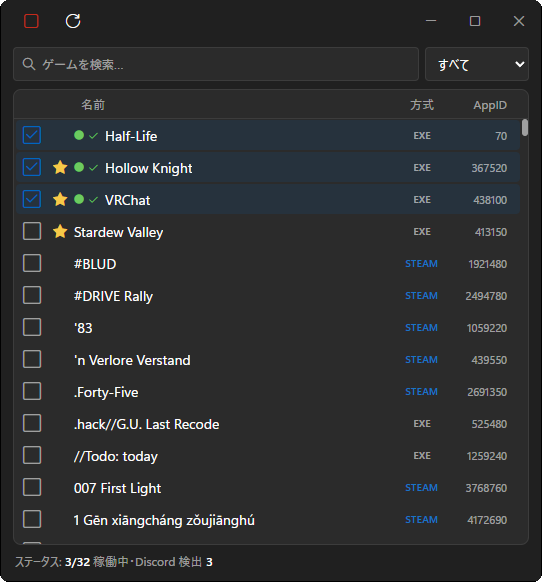

# Discord Idle Picker

Show games as "Playing" on Discord without running them.

## Features

- Pick up to 32 games from about 19,000 Discord-detectable titles
- Search, favorites and filters
- Dummy processes stop with the app and leftovers are cleaned up

## Getting Started

Requires Windows 10/11 and the Discord desktop app (plus Steam for Steam-detected games).

1. Launch `Discord Idle Picker.exe`
2. Check the games you want to show
3. Click the play button
